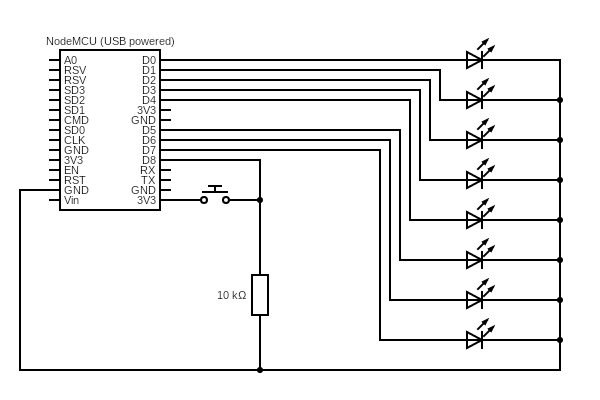

# Clocks Attack!!! LED Marquee

Animated LED background light for the Clocks Attack!!! arcade machine.

## Circuit

Components:
* ESP8266 CH340G NodeMcu V3 (https://www.aliexpress.com/item/32650004312.html)
* 25000mcd white LEDs (https://www.amazon.de/gp/product/B07RP8LHL5)

To achieve maximum brightness I decided not to use resistors for the LEDs at all. Please do this on your own risk only. It might not work with every ESP8266 and could cause damage! I recommend considering the use of transistor drivers for the LEDs.

https://www.circuit-diagram.org/editor/c/c460d7d8866d43548060bcb9f8f2a6dd
